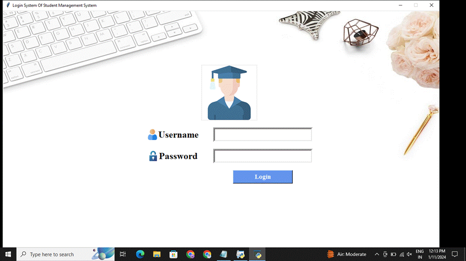

# Project Title

This Project helps you maintain student data.

## Table of Contents
- [Screenshots](#screenshots)
- [Features](#features)
- [Installation](#installation)

## Screenshots

Include screenshots or images showcasing your project. Use relative paths for images inside your project.




## Features

Describe the key features of your project. You can include bullet points or any other formatting that suits your needs.

## Installation

Provide instructions on how to install your project. You can include code snippets or commands.

```bash
npm install your-package-name
